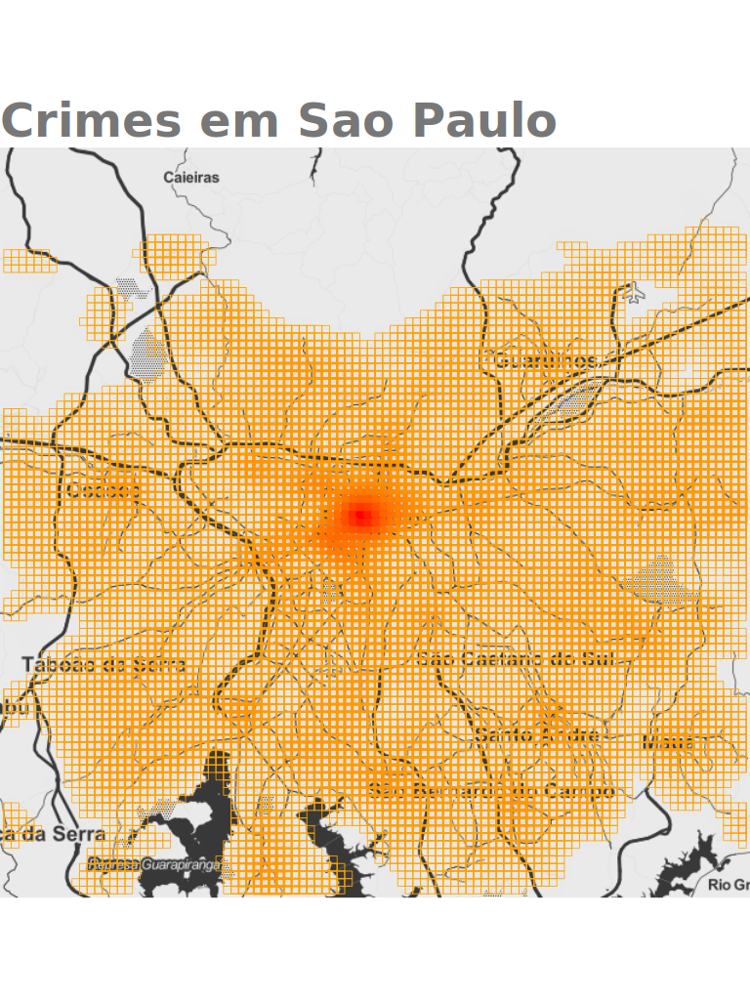

## Mapping crimes occurrences in SP using SSP dataset

This map was created using Google `ggmap` mapping all crimes occurrences of São Paulo at 2016. The dataset contains about 770 thousands of rows, so, the plotting proccess can take some minutes to finish.

Fell free to filter types os crimes, cities, police stations, and other data presented in this dataset

### Example:

